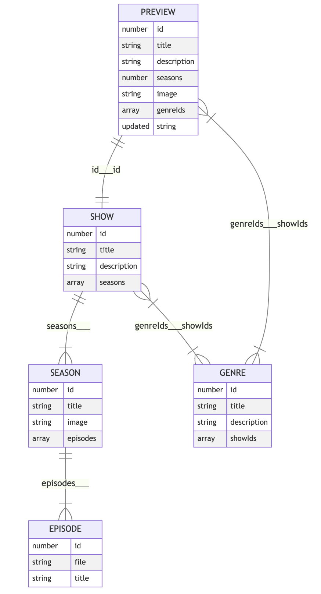

# Podcast-App
### ( PODCASTED )

#### developed by Stefan Schutte.
STESCH302_FTO2308_GroupA2_Stefan-Schutte_-_DWA_18_Final_Capstone

This is Stefan Schutte's Podcast App.

Author: Stefan Schutte

Application: Podcast App

Github Link: https://github.com/StefanSchutte/STESCH302_FTO2308_GroupA2_Stefan-Schutte_DWACapstone

## Description:

A podcast app that allows users to browse various podcasts shows, play episodes and track their favorite episodes.

## How to use PODCASTED App:
#### HOME
- On loading into the deployed site you will arrive at the Home page, which has a 'Hero' section and a 
Row below that. 
- The 'Hero' section provides a recommended Podcast, with the name genre and description.
- User can navigate to the PodcastInfo overlay by clicking the play/listen button. The Hero section is changed every minute.
- The 'Browse All Shows' row provided the user the possibility to browse through all the podcasts using the right and left arrow slider.
- Users can also navigate to the PodcastInfo overlay, the same as with the 'Hero' section.

#### MENU
- User should use this to navigate through application.
- The 'Menu' includes: 
- A 'home' button, that navigates user back to the 'Home' page. 
- A 'filter' button that navigates the user to the 'Filter' page. 
- If the user is not signed up or logged in, the user sees the 'login' and 'sign up' buttons.
- New user can sign up and after confirming via email sent, can log in.
- Old user will use the 'login' button, that will navigate the user to 'Account' page.
- If user is logged in instead of seeing a 'login' and 'sign up' button, a 'account' and 'logout' button will be rendered.

#### FILTER
- The 'filters' page gives the user the opportunity to filter through the podcasts by either:
- Using the 'search' input to filter podcasts based on the text users inputs, This functionality uses Fuse.js.
- From the 'Filter' dropdown user can filter podcasts by date and alphabetically.
- User can also filter using the genre labels.
- In the 'Results' section of this page, the results are rendered.
- Each result (Preview) contains a title, image, amount of seasons, date updated and the genres.
- When clicking on any of these result previews user navigates to the 'Podcast Info' overlay.

#### PODCAST INFO

- In this overlay the Show title and image is rendered as well as a detailed description of the Show is given.
- The date last updated and amount of seasons are also rendered.

- In the 'Select Season' dropdown the user can select a Season, or the user can also use the 'See More' button, next to the dropdown.
- The 'See More' button expands the Seasons list that includes the Season image.
- After selecting a season, the user can select an episode.
- In the 'Select Episode' dropdown the user can select an Episode, or the user can also use the 'See More' button, next to the dropdown.
- A description of the Episode is given on hover.
- After selecting the Episode, user can Play or Save the Episode, using the play button on top right corner, and saving by clicking the save button.

#### PLAY
- Pressing the play button opens the Audio Player at the bottom of the page.
- User can navigate through episode on timestamp bar.
- User can close audio player by clicking close.

#### FAVORITES
- Users favorites are saved under the Favorites page.
- Similar to Filters page, user sees a list of the saved Episodes.
- User can sort and group favorites by clicking the labels for desired requirement.
- User can click play button to listen to the episode.
- User can delete episode by clicking the delete button.
- User can also share their favorite Episodes.

## Deployment:
The app is deployed to a custom Netlify URL, ensuring accessibility to users across various devices and platforms.
LINKHERE

## Technologies used:
- React
- React Router Dom
- Vite
- TypeScript
- TailwindCSS and postcss
- Supabase
- Fuse.js
- ES Lint
- Webstorm
- metatags.io
- Google Fonts

### Technologies reasoning:
1. React.
- Reacts component-based architecture allows for creation of reusable and modular UI components.
- React consists of a large ecosystem of libraries and tools, making it easier to find solutions and extending the project's functionality.
- Virtual DOM updates DOM by only re-rendering components that have changed, which results in better performance.

2. Vite.
- Vite is a fast development server that provides hot module replacement, meaning changes is seen in real-time.
- Vite leverages ES modules for faster build times.
- Vite offers build-in support for TypeScript.

3. Tailwind Css.
- Allows for rapid prototyping by providing a set of utility classes, that is applied directly on HTML elements.
- Makes it easier to maintain a consistent style across project.
- Tailwind offers extensive customization options.
- Makes me excited.

4. TypeScript.
- Helps catching errors at compile-time by enforcing static types, reducing possibilities of runtime errors.
- TypeScript's static types serves as documentation, enhancing code readability.
- Tooling support like autocompletion, type inference, refactoring tools.

### ShowsContext

#### ShowsContext Endpoints:
- Preview objects - https://podcast-api.netlify.app/shows
- Show object with seasons and episodes - https://podcast-api.netlify.app/id/<ID>

#### ShowsContext DATA
- Episode - Corresponds to a specific MP3 file. 
- Season - A collection of Episodes, released across a specific timespan.
- Show - A podcast that contains seasons.
- Preview - A summarised version of a show, that do not contain the season or episode data.

#### ShowsContext Relationships

- 'Episodes' make up a 'Season'.
- 'Seasons' make up a 'Show'.
- 'Show' and 'Preview' are different forms of same data, but related by ID property.
- 'Show' and 'Preview' have a property name 'Genre'.
- 'Genre' inside 'Preview' is an array of numbers called the id.
- 'Genre' inside 'Show' is an array of strings called title.

##### Entity Relationship Mapping
gecopy
Note that the text between the units indicates what properties map to one another. It is separated using three underscores (___). The value before the underscores is the mapping from the parent object, whereas the values after the underscore are the mapping from the child object.
PLEASE NOTE: In some cases, there is no way to infer the parent from the child itself; in those cases, just the parent map is noted, with no value after the underscores.

[Mermaid.js Docs](https://mermaid.js.org/syntax/entityRelationshipDiagram.html)
### Genre Mapping:
Genre array IDs are assigned titles as follow:
- 1 -	Personal Growth
- 2 -	True Crime and Investigative Journalism
- 3	- History
- 4	- Comedy
- 5	- Entertainment
- 6	- Business
- 7	- Fiction
- 8	- News
- 9	- Kids and Family

## Features:
#### Browsing Shows and Episodes.
- Users can explore a wide range of podcast shows available on the platform.
- Preview images and genre information provide a glimpse into each show's content.
- Human-readable dates indicate when each show was last updated, keeping users informed about the latest content.

#### Detailed Show View
- Users can dive deeper into their favorite shows, viewing detailed information broken down into seasons.
- Each season is sorted, making it easy to navigate through the show's episodes.

#### Listening Experience
- Seamless dummy audio listening experience, allows users to play episodes within platform.
- An audio player, displays current progress and episode length as timestamps for user convenience.

#### Advanced Functionality
- Sorting and filtering options enable users to arrange shows and episodes based on various criteria, such as title and date updated.
- Fuzzy matching of strings facilitates quick and accurate search results, enhancing the browsing experience.

#### User Authentication and Data Syncing
- Users can log in via secure authentication provided by Supabase.
- Favorite episodes are stored in the Supabase database and automatically synced when logged in, ensuring a seamless experience across devices.
- Users can share their favorite episodes using a publicly accessible URL, fostering community engagement and sharing.

#### Favorite Episodes
- Users can mark specific episodes as favorites, making it easy to revisit them later.
- Favorite episodes are grouped by season and show, allowing for organized and efficient management.

#### Personalization
- The app remembers the user's listening history, including the last show and episode listened to, and the timestamp progress of any episode started.
- Users can reset their listening progress if desired, effectively clearing their history.

## User Stories:

Project is deployed to a custom Netlify URL

✅ All views in the app display correctly on the smallest mobile device available, “iPhone SE”. This can be emulated in Chrome Dev tools.

✅ All favicon information has been created an added correctly via https://realfavicongenerator.net/ (you are welcome to use any free PNG image you find on https://www.flaticon.com/)

? All metatag information has been created and added via https://metatags.io/ (You are welcome to use any free image on https://unsplash.com/). Be mindful to manually replace all URL values (especially image URL) to absolute Netlify URL values (you will need to deploy to Netlify first)

✅ All show data loaded via a fetch call from the https://podcast-api.netlify.app/shows

✅ When viewing a specific show, data is loaded via fetch from individual show endpoint

✅ There is a loading state while initial data is being loaded

✅ There is a loading state while new data is being loaded

✅ User can view the details of a show broken down into seasons, sorted by number

✅ User can listen to any episode in a season of a show

✅ User can see a view where only episodes for a specifically selected season are shown

✅ User can toggle between different seasons for the same show

✅ User can see the name of all available shows on the platform

✅ User sees preview image of shows when browsing

✅ User sees the amount of seasons per show as a number when browsing

✅ User sees a human-readable date as to when a show was last updated

✅ User sees what genres (as genre titles) a show is associated with when browsing

✅ User sees a preview image of seasons for a specific show

✅ User sees the amount of episodes in a season as a number

✅ User can go back to a show view from a season-specific view

✅ User can mark specific episodes as favourites to find them again

✅ User can visit a view where they see all their favourites

✅ User can see the show and season of any episode in their favourites list

✅ Episodes related by season/show are grouped in favourites

✅ User is able to remove episodes from their favourites

✅ User can arrange the list of shows by title from A-Z

✅ User can arrange the list of shows by title from Z-A

✅ User can arrange the list of shows by date updated in ascending order

✅ User can arrange the list of shows by date updated in descending order

✅ User can filter shows by title through a text input

✅ User can find shows based on fuzzy matching of strings (you can use something like https://fusejs.io/)

✅  Automatically filter shows by genre if the genre label is clicked on

✅ User sees the date and time that an episode was added to their favourites list

✅ User can arrange favourites by show titles from A-Z

✅ User can arrange favourites by show titles from Z-A

✅ User can arrange favourites by date updated in ascending order

✅ User can arrange favourites by date updated in descending order

✅ Audio player shows current progress and episode length as timestamps

✅ Audio player is always visible, so the user can listen to episodes while they browse

✅ User is prompted to confirm they want to close the page when audio is playing

 App remembers which show and episode the user listened to last when returning to the platform

✅ App remembers which shows and episodes the user listened to all the way through

✅ App remembers the timestamp where the user stopped listening within a 10-second accuracy period of closing

✅ App remembers and shows the timestamp progress of any episode the user has started listening to

✅ User can "reset" all their progress, effectively removing their listening history

✅ User is presented with a sliding carousel of possible shows they might be interested in on the landing page

✅ User can log in via https://app.supabase.com authentication

✅ User favourites are stored in the https://app.supabase.com database

✅ User favourites are automatically synced when logged in, ensuring that they share favourites between devices

✅ Users can share their favourites as a publicly accessible URL
